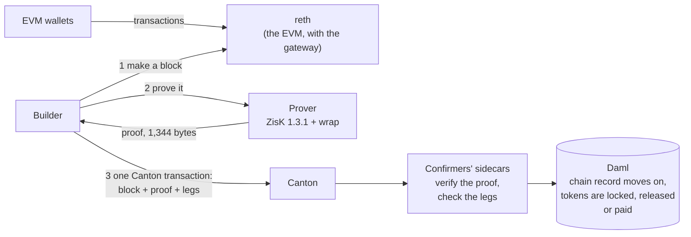

# ZK EVM on Canton: the design

Rome Protocol

## What we want

Ostia, a Canton zkEVM (chain id 770101): one EVM chain whose blocks are ordered by Canton and proven by a zkVM (ZisK), so that an EVM block and the Canton actions it needs settle together in one Canton transaction. A Canton token can move onto the EVM and back, and an EVM payment can be tied to the Canton payment it stands for. Blocks are made on demand. Each builder run builds, proves and submits one block. Speed and throughput are not goals yet.

## The idea

Every EVM block becomes one Canton transaction, and only once it is proven. That transaction carries the block, its proof and the Canton actions the block asked for. Canton's confirmers check the proof. Daml checks that the block follows the chain's current head. The block and its actions commit together, or neither does.

The EVM side writes down what a block needs from Canton. One small contract, the gateway, is part of the chain from its genesis. Transactions that have a Canton side go through it, and it keeps one running hash per block of the requests they made. Each request is a leg, and there are three kinds:

- **Deposit.** A Canton token is locked with the gateway, and its wrapped form is minted on the EVM to the address that claims it.
- **Withdrawal.** The wrapped form is burnt, and the gateway releases the Canton token to a Canton party.
- **Payment.** An ERC-20 payment made through the gateway executes a Canton allocation that the payer and the payee agreed to, for that payment and no other.

The proof fixes the chain's state at the end of the block, so it fixes what the gateway wrote. `Advance` receives the legs with the proof and settles all of them, or the Canton transaction fails and the block with it. The same check serves all three kinds. Adding the gateway needed no change to the proven program: it is ordinary EVM code, and the program key is the one the first proof used.

## The parts

| Part | What it does |
|---|---|
| **reth** | A stock Ethereum execution client with our own genesis, which also holds the gateway. It makes a block only when the builder asks. Peer discovery is always off. |
| **Gateway** | The EVM contract that records each block's legs and makes the wrapped tokens. It has no owner, no admin key, no upgrade and no pause. See [gateway/README.md](../gateway/README.md). |
| **Builder** | Picks the transactions, asks reth for the block, reads the block's legs and finds the Canton contracts they need, sends the block to the prover, and submits the proven block with its legs to Canton. It cannot finalize anything or change Canton's order. |
| **Prover** | ZisK 1.3.1 running our copy of its EVM program, with our chain's rules built in. It outputs a small wrapped proof (1,344 bytes) that commits to the block's hash. |
| **Daml package** | The chain's one state contract (its current head), a record per block, and the contracts for deposits, withdrawals, payments and registered tokens. See [daml/README.md](../daml/README.md). |
| **Sidecar** | A small Rust program beside each confirming participant. It does two things: `verify` checks a proof, and `legs` checks that the legs attached to a block hash to the value the proven block recorded in the gateway (an account proof and a storage proof, at the block's state root). |
| **Canton network** | A local network of our own, with a party for the gateway. |
| **Explorer** | Shows each EVM block next to its Canton record, read as the reader party. Its Verify button runs the sidecar's block check in the browser through WebAssembly. Its faucet sends the test coin, tROME, through reth. |

## One block

1. Wallets send EVM transactions to reth as usual. A transaction that has a Canton side calls the gateway, which writes the leg and folds it into the block's running hash.
2. The builder asks reth for block n on top of the chain's current head, and reads the legs from the gateway's events.
3. For each leg the builder looks for its Canton side: a deposit needs the depositor's request and allocation, a withdrawal needs the receiver's standing acceptance, a payment needs the terms that carry its id. If a leg has none, the builder leaves out the transaction that made it, moves reth back to Canton's head and builds again. Nothing has been proven by then.
4. The prover proves block n.
5. The builder submits one Canton transaction: block n, its proof, the legs and the gateway's proofs of its state at the end of the block.
6. Each confirmer's sidecar verifies the proof. Daml checks that block n's parent is the current head, that the proof came from our program and ZisK release, and that the block is within the gas cap.
7. Daml writes one line for each leg from the Canton contracts it names, and the sidecar hashes those lines as the gateway does and compares the result with the value the proven block recorded. A block with no legs is checked in the same way, with no lines, which is how it is shown that it needed none.
8. Daml settles the legs in order: it locks the deposited token, pays the withdrawn token to its receiver, or executes the payment's allocation.
9. Canton commits everything at once: the chain record moves to block n, the block is recorded, and the legs settle. If any check fails, nothing changes; reth returns to Canton's head and the next builder run builds and proves again.

## The flows

**A deposit.** The depositor, U, allocates a Canton token to the gateway, with the operator as executor, and signs a deposit request: an id, the EVM address that may claim, and the allocation. The address sends `claim(id, token, amount)` to the gateway, which mints the wrapped token to the sender and records a deposit leg. The builder matches the leg to the request by its id. `Advance` executes the allocation, so the token is now held by the gateway. The block record and the gateway's new holding come from one Canton update.

**A withdrawal.** A holder sends `withdraw(token, amount, party)`. The gateway burns the wrapped tokens and records a withdrawal leg that names the Canton party. That party must already have signed a standing acceptance of withdrawals; if it has not, the builder leaves the transaction out. `Advance` has the gateway pay the Canton token from its custody to the party, through the token registry's own transfer factory. Again the block record and the new holding come from one update.

**A payment tied to a Canton payment.** U allocates a Canton token to V. U and V sign terms that name a payment id, the EVM token, the payee and the amount; the id is derived from U, V and a label, so only terms both signed can carry it. V approves the gateway and sends `pay(id, token, to, amount)`, which moves the ERC-20 from V to the payee and records a payment leg. `Advance` executes the allocation, and V gets the Canton token. A plain transfer of the same token, even to the same person in the same block, is not a payment: it moves the token on the EVM, but it records no leg and settles nothing on Canton. This replaces an earlier rule that settled a leg when the holder's balance rose by the expected amount in the block. That rule could not tell the payment from any other transfer of the same size.

**Why neither side can be final without the other.** A block cannot commit without every leg it recorded, and a leg cannot settle outside `Advance`. A payment made on the EVM does not become final until the Canton payment it names has been made, and the other way round.

## Why it holds

- **No proof, no block.** `Advance` verifies the proof before Canton commits the block. The builder returns reth to Canton's head after a refused submission.
- **Canton orders.** Every block consumes the chain's one state contract, so Canton alone decides which block comes next.
- **The proof fixes the rules.** Our program refuses any chain settings except its own, and every confirmer pins that program's key. A block proven under other rules is refused. The genesis state root in the chain record fixes the gateway's code, so the gateway cannot be changed.
- **The legs are the block's legs.** The attached legs must hash to the value the proven block recorded in the gateway. A leg that is missing, an extra one, a different order, or any changed field (another recipient, amount, id or token) gives another hash, and `Advance` is refused.
- **Canton legs settle only with a proven block.** Settling a leg requires the operator and the confirmer, and for a deposit or a withdrawal the gateway as well. The design provides their joint authority only inside a block's transaction. The builder cannot settle a leg. The operator and confirmer together are the root of trust because they both sign the chain record.
- **The chain can be re-checked.** A party that can read the block records, such as the reader party, can re-verify every proof. The explorer exposes that reader's view. The supplied local network keeps the records in memory and loses them on restart.

**Custody.** The gateway party holds the Canton tokens that are locked for their wrapped forms. It is hosted on the operator's participant, so whoever runs that participant can move the locked tokens. Under the Daml rules, they leave only inside `Advance`, for a withdrawal that the proven block recorded; but a Canton party can always act through its own participant. This is acceptable for a local proof where we run every party, and not for anything of value. Registering a token is also a trust decision, because the gateway runs that token's registry's Daml code with its own authority.

## What the demo showed

On our own local Canton network, in a setup block and five runs ([demo/README.md](../demo/README.md) has them in full):

- **A deposit** of 10 TKB: U ends with 10 wTKB, and the supply of wTKB and the gateway's custody are both 10.
- **A payment** of 10 TKA from V to U against U's allocation of 10 TKB, with a plain transfer of 1 TKA in the same block that moved on the EVM and made no leg.
- **A withdrawal** of 4 wTKB: U gets 4 TKB, and the supply and the custody fall to 6.
- **A payment whose allocation is taken back after the proof was made:** Canton refuses the block and nothing moves. The same proven block sent again without its leg is refused too ("the legs are not the ones the block recorded"). The next builder run leaves the payment out and commits.
- **A tampered proof:** refused by the sidecar, and nothing moves.

These ran on a local network started for the run; Ostia does not yet run as a standing network.

## Numbers we have

The machine, the versions and every measurement, with dates and sources, are in [METRICS.md](METRICS.md).

- Proof: 6.7 s (1 transfer) to 21.2 s (5,000 transfers) on one NVIDIA RTX PRO 6000, with a prover that stays running. Measured in the prover benchmark on the upstream reth guest, not on this repository's guest; see [METRICS.md](METRICS.md).
- Proof size: 1,344 bytes. Measured.
- On this chain, in the demo (2026-10-05, one machine, commit `6b445073163832e9023850f53678617d90dfc808`): a block with no transactions was proved in 6.31 s, and the blocks of the runs in 6.71 to 6.75 s. The time from the finished proof to Canton's commit on both confirmers and reth marking the block final was 0.49 s for an empty block, 0.66 s for the deposit, 0.42 s for the payment and 0.58 s for the withdrawal. That interval also includes fetching the gateway's account and storage proofs from reth (one `eth_getProof` call), so it is more than Canton's commit alone. The builder matches the legs to Canton contracts before it proves the block, so that work is not in it. Measured; see [demo/results/](../demo/results/).
- Not yet measured on their own: building the witness on a warm machine, the sidecar's proof check run natively, and the Canton commit of a large block. The WebAssembly build took 8 to 32 ms in Node on CI runners for verifying a proof and rejecting a mismatched header; see [explorer/verify/README.md](../explorer/verify/README.md).

The recorded GPU demo ran from commit `6b445073163832e9023850f53678617d90dfc808` of this repository (6b44507). The Daml tests check the refusals of each leg kind; the GPU runs and the CI rehearsal check the cases listed in [demo/README.md](../demo/README.md#results).

## Rules

- The supplied reth launcher disables peer discovery.

## Not now

Throughput and block-time targets, more than one builder, forced inclusion, public Canton (the Global Synchronizer), privacy and hardening. Hardening includes custody that needs more than the operator's participant (for example, the gateway party hosted on both participants with a threshold), and a builder that remembers across runs which transaction a token registry refused (today the next run needs `--exclude`). The recipient of a deposit sends its own `claim` and so needs a little tROME for gas; the gateway's `claim` mints to its caller, so the recipient sends it; having the gateway mint for the recipient would need a key the gateway does not have.
