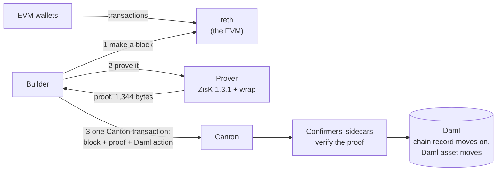

# ZK EVM on Canton: the design

Rome Protocol

## What we want

Ostia, a Canton zkEVM (chain id 770101): one EVM chain whose blocks are ordered by Canton and proven by a zkVM (ZisK), so that an EVM transaction and a Daml action can settle together in one Canton transaction. Blocks are made on demand. Each builder run builds, proves and submits one block. Speed and throughput are not goals yet.

## The idea

Every EVM block becomes one Canton transaction, and only once it is proven. That transaction carries the block, its proof and any attached Daml actions. Canton's confirmers check the proof. Daml checks that the block follows the chain's current head. The block and its attached actions commit together, or neither does. The builder leaves out legs whose conditions fail its checks, so an EVM transfer can commit without its intended Canton action.

## The parts

| Part | What it does |
|---|---|
| **reth** | A stock Ethereum execution client with our own genesis. It makes a block only when the builder asks. Peer discovery is always off. |
| **Builder** | Picks the transactions, asks reth for the block, sends it to the prover, and submits the proven block to Canton. It cannot finalize anything or change Canton's order. |
| **Prover** | ZisK 1.3.1 running our copy of its EVM program, with our chain's rules built in. It outputs a small wrapped proof (1,344 bytes) that commits to the block's hash. |
| **Daml package** | The chain's one state contract (its current head), a record per block, and the terms of a Daml action tied to a block. |
| **Sidecar** | A small Rust program beside each confirming participant. It does two things: checks a proof, and checks how far a balance rose in the proven EVM state (an account proof and a storage proof at the block and at its parent). |
| **Canton network** | A local network of our own for the first proof. |
| **Explorer** | Shows each EVM block next to its Canton record, read as the reader party. Its Verify button runs the sidecar's block check in the browser through WebAssembly. Its faucet sends the test coin, tROME, through reth. |

## One block

1. Wallets send EVM transactions to reth as usual.
2. The builder asks reth to build block n on top of the chain's current head.
3. The prover proves block n.
4. The builder submits one Canton transaction: block n, its proof, and any Daml action tied to it.
5. Each confirmer's sidecar verifies the proof. Daml checks that block n's parent is the current head, that the proof came from our program and ZisK release, and that the block is within the gas cap.
6. If a Daml action is attached, the sidecar checks its condition against the proven state: the holder's balance rose by exactly the expected amount in this block (for example, "U's balance of the token rose by 10"), worked out from block n's state and its parent's. Daml then performs the action. At most one action per token and holder settles in a block, so one payment cannot satisfy two of them.
7. Canton commits everything at once: the chain record moves to block n, the block is recorded, and the Daml action settles. If any check fails, nothing changes; the next builder run builds and proves again.

## Why it holds

- **No proof, no block.** `Advance` verifies the proof before Canton commits the block. The builder returns reth to Canton's head after a refused submission.
- **Canton orders.** Every block consumes the chain's one state contract, so Canton alone decides which block comes next.
- **The proof fixes the rules.** Our program refuses any chain settings except its own, and every confirmer pins that program's key. A block proven under other rules is refused.
- **Daml actions move only with a proven block.** Settling an action requires both the operator and the confirmer. The design provides their joint authority only inside a block's transaction. The builder cannot settle an action. The operator and confirmer together are the root of trust because they both sign the chain record.
- **The chain can be re-checked.** A party that can read the block records, such as the reader party, can re-verify every proof. The explorer exposes that reader's view. The supplied local network keeps the records in memory and loses them on restart.

## The composable example

V sends U 10 tokens on the EVM. In the same Canton transaction, U's Canton holding moves to V, but only if U's balance rose by exactly 10 tokens in the proven block. U's holding is locked beforehand with Canton's token-standard allocation. If the allocation is gone when the builder checks, it leaves out the leg and the block can commit without it. If U withdraws the allocation after that check, Canton refuses the submission. The next builder run builds and proves a block without that leg.

## The first proof, and what "working" means

On our own local Canton network:
- **One good block:** V's 10-token EVM transfer and U's Canton holding move together in one Canton transaction.
- **One bad block:** a tampered proof is refused, and nothing moves.

This first proof is not a live chain.

## Numbers we have

The machine, the versions and every measurement, with dates and sources, are in [METRICS.md](METRICS.md).

- Proof: 6.7 s (1 transfer) to 21.2 s (5,000 transfers) on one NVIDIA RTX PRO 6000, with a prover that stays running. Measured in the prover benchmark on the upstream reth guest, not on this repository's guest; see [METRICS.md](METRICS.md).
- Proof size: 1,344 bytes. Measured.
- On this chain, in the demo (2026-10-04, one machine): a block proved in 6.3 to 6.8 s (the tampered-proof run, run 2, took 6.66 s). The time from the finished proof to Canton's commit on both confirmers and reth marking the block final was 0.51 s for an empty block and 0.83 s for a block with one transfer and one Daml leg. That interval also includes assembling the Daml legs (the builder's Ledger reads and `eth_getProof` calls to reth), so it is more than Canton's commit alone. Measured; see [demo/results/](../demo/results/).
- Not yet measured on their own: building the witness on a warm machine, the sidecar's proof check run natively, and the Canton commit of a large block. The WebAssembly build took 8 to 32 ms in Node on CI runners for verifying a proof and rejecting a mismatched header; see [explorer/verify/README.md](../explorer/verify/README.md).

The recorded GPU demo ran from this repository's first commit, `c6d81619c05ad8efa76cd0345178f01410a3dac9`, with the current leg rule: a leg settles only if the holder's balance rose by exactly the expected amount in the proven block. The Daml tests check the refusals of that rule; the GPU runs and the CI rehearsal do not. See [demo/README.md](../demo/README.md#results) for the tests and the recorded runs.

## Rules

- The supplied reth launcher disables peer discovery.

## Not now

Throughput and block-time targets, more than one builder, forced inclusion, deposits and withdrawals beyond the one example, public Canton (the Global Synchronizer), privacy and hardening.
